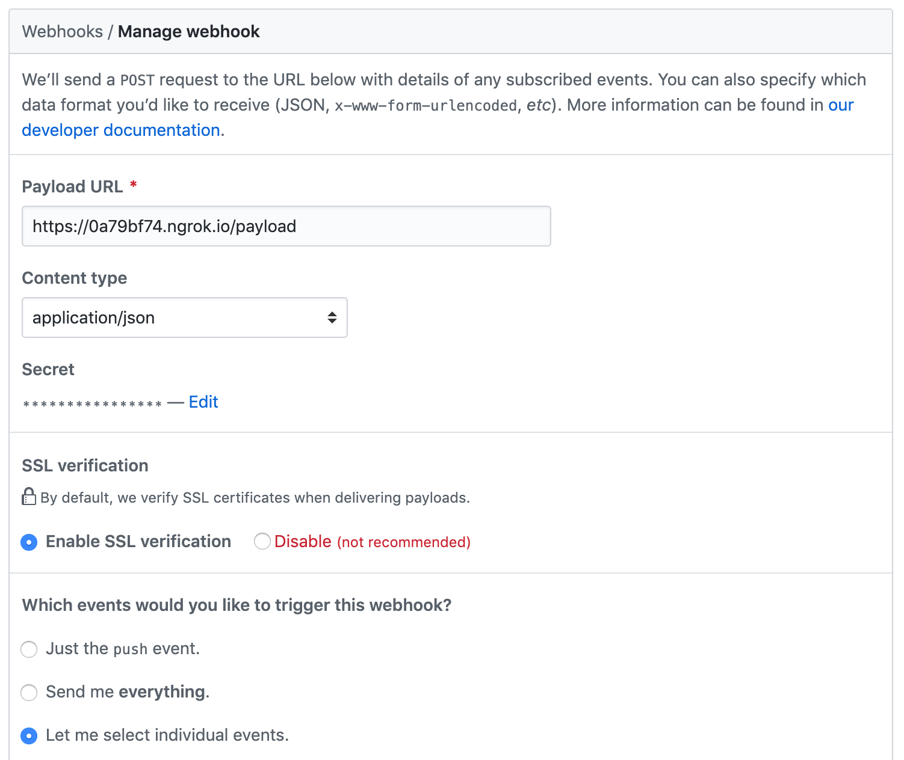

BranchGuard
===========

BranchGuard is a simple [Sinatra app](http://sinatrarb.com/) to listen
for repository events from the GitHub API and automatically protect the
master branch of new any repositories it is notified of.

Dependencies
------------

redis
ruby 2.6

How to use
----------

If you're on a Mac running homebrew, `script/setup` should get you most
of the way there. You will also need to put a GitHub personal access
token with repo permissions into there `.env` file that is generated.

After that you can start the webserver as well as the test runner and
queue worker all with `script/server`.

Once you've got the app running, if it is not exposed to the public
internet, I recommend [ngrok](https://ngrok.com) to tunnel internet
traffic to your development machine. If you ran `script/setup` on your
Mac, ngrok is already installed. To fire it up just run:

`ngrok http 4567`

ngrok will display a temporary URL. Now you're ready to setup your
webhook.

Go to your GitHub organization settings and find the Webhooks panel. Add
a new webhook, and make it look something like this:

Input the SECRET_TOKEN that `script/setup` put in your `.env` file here.
Substitute your ngrok.io hostname for the above, and make sure to set
the Content type to `application/json`.

Under "Let me select individual events" check only "Repositories". Make
sure the Active checkbox is selected and save your new webhook.

You're ready to go.

Create a new repo in your organization and watch as the master branch is
protected almost immediately.

Having trouble?
---------------

First check to see if ngrok shows a request coming in. It should show
you the request and the app's response code.

You can also look in your organization's webhook settings for a request and
response log that might help you troubleshoot what's going wrong. You
can find those by clicking on the Webhook in the listing and scrolling
all the way to the bottom.

Running the test suite
----------------------

Run `script/test`.
